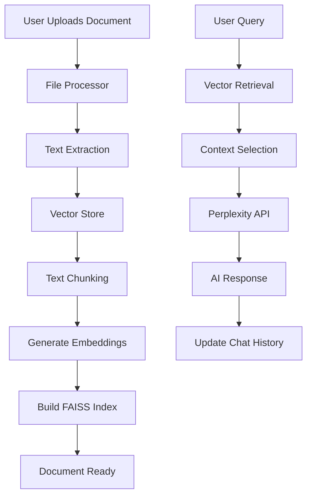

# SmartDoc Assistant 🤖

**A Professional Document Processing and Chat Application using RAG (Retrieval-Augmented Generation)**

SmartDoc Assistant is an intelligent document analysis application that combines local vector search capabilities with Perplexity AI to provide conversational interactions with your documents. Upload PDF, DOCX, or TXT files and ask questions about their content in natural language.

## ✨ Features

- 📄 **Multi-format Support**: Process PDF, DOCX, and plain text files
- 🔍 **Intelligent Search**: Local vector-based document retrieval using FAISS
- 💬 **Conversational Interface**: WhatsApp-style chat with timestamps
- 🧠 **AI-Powered Responses**: Integration with Perplexity API for intelligent answers
- 📊 **Session Management**: Track conversation history and document statistics
- ⚡ **Efficient Processing**: One-time document indexing with persistent vector storage
- 🎨 **Professional UI**: Clean, responsive Streamlit interface

## 🏗️ Architecture

SmartDoc Assistant follows a modular, production-ready architecture:

```
SmartDoc Assistant/
├── app.py                 # Main Streamlit application
├── rag.py                 # Enhanced RAG system with Perplexity integration
├── vector_store.py        # FAISS-based vector database
├── file_processor.py      # Document text extraction utilities
├── requirements.txt       # Python dependencies
├── .env                  # Environment variables (create this)
├── .gitignore            # Git ignore rules
└── README.md             # This file
```

### Component Overview

| Component             | Purpose                              | Key Technologies                 |
| :-------------------- | :----------------------------------- | :------------------------------- |
| **app.py**            | Web interface and user interaction   | Streamlit, Custom CSS            |
| **rag.py**            | RAG orchestration and AI integration | Perplexity API, Request handling |
| **vector_store.py**   | Document vectorization and retrieval | FAISS, SentenceTransformers      |
| **file_processor.py** | Multi-format text extraction         | PyPDF2, python-docx              |

### System Flow



## 🚀 Quick Start

### Prerequisites

- Python 3.8 or higher
- Perplexity API key (sign up at [perplexity.ai](https://www.perplexity.ai))
- 4GB+ RAM recommended for document processing

### Installation

1. **Clone the repository**

```bash
git clone https://github.com/yourusername/smartdoc-assistant.git
cd smartdoc-assistant
```

2. **Create virtual environment**

```bash
python -m venv venv

# On Windows
venv\Scripts\activate

# On macOS/Linux
source venv/bin/activate
```

3. **Install dependencies**

```bash
pip install -r requirements.txt
```

4. **Set up environment variables**

Create a `.env` file in the root directory:

```env
PERPLEXITY_API_KEY=your_perplexity_api_key_here
```

5. **Run the application**

```bash
streamlit run app.py
```

6. **Access the application**

Open your browser and navigate to `http://localhost:8501`

## 📋 Requirements

Create a `requirements.txt` file with these dependencies:

```txt
streamlit>=1.28.0
sentence-transformers>=2.2.0
faiss-cpu>=1.7.4
PyPDF2>=3.0.0
python-docx>=0.8.11
requests>=2.31.0
python-dotenv>=1.0.0
numpy>=1.24.0
```

## 💻 Usage Guide

### 1. Document Upload

- **Supported Formats**: PDF, DOCX, TXT files
- **Maximum Size**: 20MB per file
- **Processing Time**: Varies based on document size (typically 5-30 seconds)

### 2. Chat Interface

- **Natural Language**: Ask questions in plain English
- **Context Awareness**: Maintains conversation history (last 10 messages)
- **Real-time**: Instant responses with thinking indicators

### 3. Example Interactions

```
You: What is this document about?
AI: This document appears to be a research paper on agricultural crop disease analysis...

You: What are the main findings?
AI: Based on the document, the main findings include: 1) Early detection improves crop yield by 23%...

You: Can you summarize the methodology?
AI: The methodology section describes a computer vision approach using...
```

## 🔧 Configuration

### Environment Variables

| Variable             | Description             | Required | Default |
| :------------------- | :---------------------- | :------- | :------ |
| `PERPLEXITY_API_KEY` | Your Perplexity API key | ✅ Yes   | None    |
| `LOG_LEVEL`          | Logging level           | ❌ No    | INFO    |

### Vector Database Settings

Modify these constants in `vector_store.py`:

```python
DEFAULT_CHUNK_SIZE = 600        # Words per chunk
DEFAULT_OVERLAP = 50            # Overlapping words
DEFAULT_SIMILARITY_THRESHOLD = 0.2  # Minimum similarity score
```

### File Processing Limits

Adjust limits in `file_processor.py`:

```python
MAX_FILE_SIZE_MB = 200          # Maximum file size
MAX_PDF_PAGES = 1000           # Maximum PDF pages
MIN_CONTENT_LENGTH = 10        # Minimum content length
```

## 📡 API Integration

### Perplexity API

SmartDoc uses Perplexity's `sonar` model for generating responses:

- **Model**: `sonar` (offline processing model)
- **Context Window**: Up to 128k tokens
- **Temperature**: 0.1 (for consistent responses)
- **Max Tokens**: 1000 per response

### Rate Limits

- **Perplexity**: Depends on your subscription plan
- **Local Processing**: No limits (uses local models)

### Running in Development Mode

```bash
# Enable debug mode
export STREAMLIT_LOGGER_LEVEL=debug
streamlit run app.py --logger.level=debug

# Run with auto-reload
streamlit run app.py --server.runOnSave=true
```

### Logging

The application generates comprehensive logs:

- **File**: `rag_app.log`
- **Format**: `%(asctime)s - %(name)s - %(levelname)s - %(message)s`
- **Levels**: DEBUG, INFO, WARNING, ERROR, CRITICAL

### Best Practices

- Keep API keys secure in `.env` files
- Use HTTPS in production deployments
- Implement file size and type validation
- Regular security updates for dependencies

## 🚀 Deployment

### Local Deployment

```bash
streamlit run app.py --server.port=8501
```

### Cloud Deployment (Streamlit Cloud)

1. Push code to GitHub repository
2. Connect to Streamlit Cloud
3. Add environment variables in Streamlit Cloud settings
4. Deploy with automatic SSL and scaling

## 🤝 Contributing

1. Fork the repository
2. Create a feature branch (`git checkout -b feature/amazing-feature`)
3. Commit changes (`git commit -m 'Add amazing feature'`)
4. Push to branch (`git push origin feature/amazing-feature`)
5. Open a Pull Request

## 🐛 Troubleshooting

### Common Issues

**Issue**: "PERPLEXITY_API_KEY not found"
**Solution**: Ensure `.env` file exists with valid API key

**Issue**: Document processing fails
**Solution**: Check file format, size limits, and file integrity

**Issue**: Slow response times
**Solution**: Reduce chunk size or similarity threshold

**Issue**: Memory errors with large files
**Solution**: Increase system RAM or reduce `MAX_FILE_SIZE_MB`
